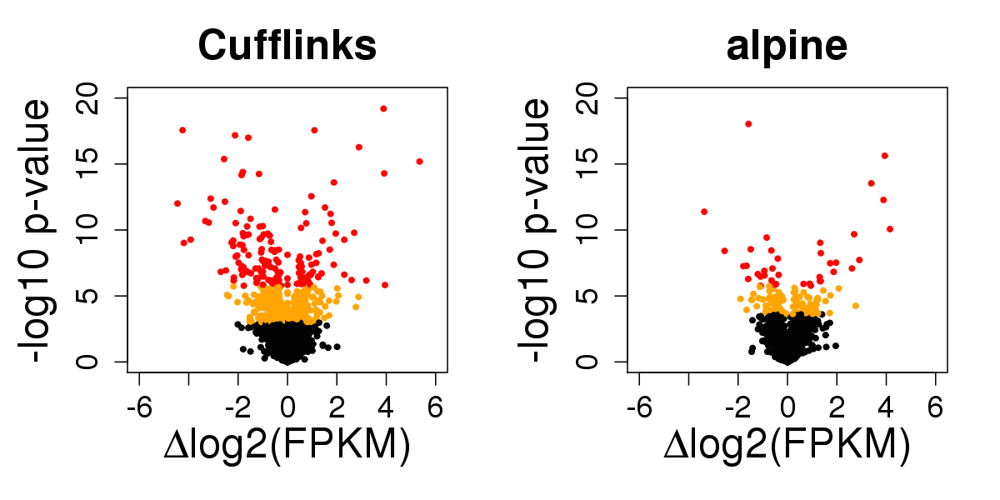
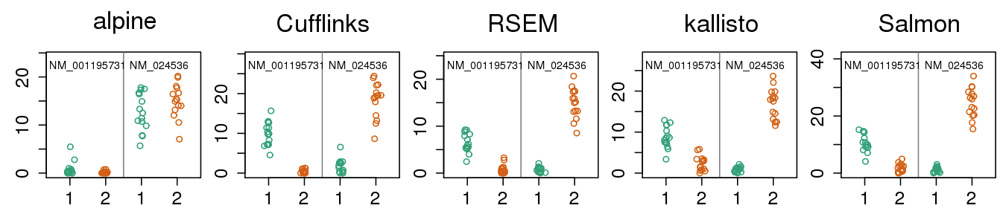

## Tackling batch effects and bias
## in transcript expression

[Michael Love](http://mikelove.github.io)  
[@mikelove](http://twitter.com/mikelove)  
[EuroBioc2015](https://sites.google.com/site/eurobioc2015/)  
December 7, 2015  
this talk: http://mikelove.github.io/eurobioc2015

---

### Two parts:

1. RNA-seq sequence biases
2. Implications for exon, transcript, and gene differential analysis

---

### Some RNA-seq biases

---

### Sequence bias correction

[Roberts et al (2011)](http://www.genomebiology.com/2011/12/3/R22/)

* A great paper on concepts of RNA-seq bias and correction
* **Random hexamer priming** is most important.
  Used by Cufflinks, eXpress, BitSeq, kallisto.
* GC content of *transcript* doesn't capture the bias
* "although normalization of expression values by GC content may be
a simple way to remove some bias, it may well be a proxy for other
effects rather than of inherent significance"

---

### Does this do the trick?

* 15 vs 15 GEUVADIS samples across sequencing center
* Cufflinks with random hexamer bias correction

* At 1% FDR, 2,500 transcripts DE (10%)
* 600 genes change major isoform (9%)
* NB: this is a lot of changes!

---

### What's going on?

* Look at genes with 2 isoforms and reporting DE
* Find the critical regions exclusive to one or other isoform
* Calculate GC content of those regions

---

### Idea:

* Inspiration from
[Benjamini and Speed, 2012](http://www.ncbi.nlm.nih.gov/pubmed/22323520)
* The correct resolution for GC content bias is at the
**fragment level**, the unit which is PCR amplified
* Include in the RNA-seq model the probability of observing a fragment,
  given its GC content

---

### A dataset where we know the exact sequence

* [Lahens et al (2014): IVT-seq](http://www.genomebiology.com/2014/15/6/R86)
* Predict coverage along the troublesome transcripts using:
  * read start bias (Cufflinks VLMM)
  * fragment GC content
  * also modeling long stretches of G|C

* color = coverage; black = test set prediction
* more examples in supplementary slides and ms

---

### Systematic comparison

* Fragment GC explains 2x more coverage variability
* Adding read start to the fragment GC: no improvement

---

[alpine](https://github.com/mikelove/alpine): a transcript quant method for comparing bias models

* read start bias (Cufflinks VLMM)
* fragment length
* positional bias
* **fragment GC content**

 

Back to 15 vs 15 GEUVADIS samples across sequencing center

---

### Four fold reduction in false positives

* 562 ⇒ 136 at FDR 1%
* alpine controls sensitivity in simulation (supp. slides)
* What are these Cufflinks false positives from?

---

### Coverage drop-out from fragment GC

* No existing quantification method corrects for this bias
* There are many genes with *critical regions* in this range
* Other experiments with problems with low GC

---

### Misidentified isoforms from coverage variability

  

* Regardless of junction spanning evidence, naive quant methods are
  tricked by variable coverage
* What about k-mer / pseudo-alignment methods?

---

### Pseudo-alignment: same misidentified isoforms

* Missing k-mers cause same problem as missing fragments for a model
which does not expect coverage drop-out
* More examples in supp slides
* Out of 5,700 tx: 136, 562, 577, 548, 614 false positives of DE

---

### Summary part 1

* No existing quant tools correct for fragment GC content
* Not just a batch problem, we see ~10% wrongly identified transcripts
in the samples with coverage variability
* [Lahens et al (2014)](http://www.genomebiology.com/2014/15/6/R86):
  bias may occur due to underlying biology
* Simulations often do not include coverage variability, so not
  learning much about accuracy for real data
* See manuscript for more details, examples: [alpine ms](biorxiv.org/content/early/2015/08/28/025767)

---

### Implications for differential analysis

* Exon usage corrected using exon GC content as covariate
* Exon usage corrected by balanced design and blocking factor
* Transcript-level perfect coverage: OK
* Transcript-level confounded: **many FP**
* Transcript-level balanced could attribute DE to wrong isoform
* Gene-level DE safer, reduces problem of misidentified isoforms

---

### Gene-level count criticisms

* Counts are correlated with feature length:
  [Trapnell et al (2013)](http://www.nature.com/nbt/journal/v31/n1/abs/nbt.2450.html) 
* Discarding multi-mapping fragments can lead to false negatives:
  [Robert & Watson (2015)](http://www.genomebiology.com/2015/16/1/177) 

 

---

### Gene-level count defenses

* For human, most common number of isoforms = 1
* Among multi-isoform genes, most transcripts are similar length:
  median ~15% difference in length
* So differential tx usage doesn't typically lead to large bias
* Transcript estimation is sometimes unidentifiable

 

---

### Why still counts?

* Statisticians want: counts & offset/exposure
* (Library size is an offset)
* I counted 10 penguins in 1 hr and 20 penguins in 2 hrs
* (Mostly important when sample size is small-ish)

 

---

### New quantification methods

* Sailfish/Salmon and kallisto are **game changing** methods
* Quantification from FASTA in minutes
* For those who still want gene-level DE  
… and to reduce problems of bias and unidentifiability:
  * Summarize counts (or estimated counts) to gene-level
  * Calculate offset based on *average transcript length*

---

### Importing for count-based methods

* Charlotte Soneson and Mark Robinson have extensively studied using
  these quant tools + Bioconductor tools, manuscript in preparation
* Together, worked on a package, [tximport](https://github.com/mikelove/tximport):
  import counts and offset (+ other options)

* (RSEM always provided average transcript length)
* (not using bootstrap variances)

---

## Supplementary slides

---

### More examples of IVT-seq coverage

---

### Isoform misidentification in GEUVADIS

---

### alpine sensitivity in simulation

* simulated confounding with GC bias from GEUVADIS

---

### alpine accuracy in simulation

* median absolute error for abundance
* left: less GC bias; right: more GC bias

---

### software details

* alpine 0.1.1 with GC content and fragment length
* Cufflinks 2.2.1 with bias correction
* RSEM 1.2.11
* kallisto 0.42.3 with bias correction
* Salmon 0.5.0 without bias correction (better performance)
