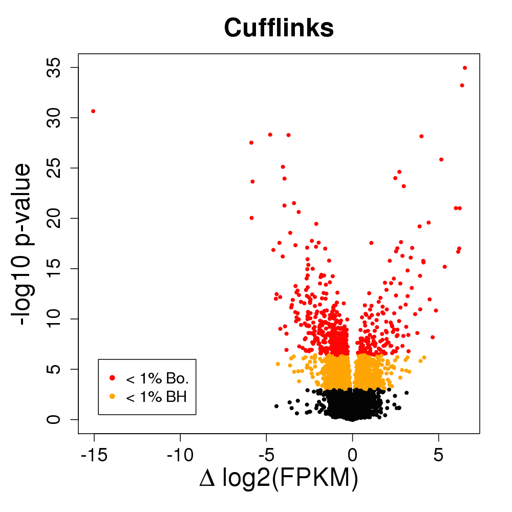
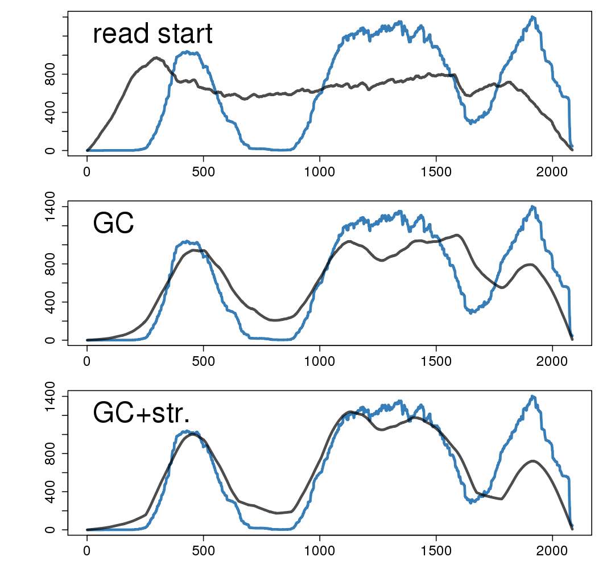
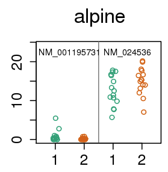

## Tackling batch effects and bias
## in transcript expression

Michael Love  
[@mikelove](http://twitter.com/mikelove)

2015-12-7: EuroBioc2015  
this talk: http://mikelove.github.io/alpine_eurobioc2015

---

### Two parts:

1. RNA-seq sequence biases
2. Implications for exon, transcript, and gene analysis

---

### Some RNA-seq biases

---

### Sequence bias correction

[Roberts, et al. Genome Biology, 2011](http://www.genomebiology.com/2011/12/3/R22/)

* A great paper on concepts of RNA-seq bias and correction
* **Random hexamer priming** is most important.
  Used by Cufflinks, eXpress, BitSeq, kallisto.
* GC content of transcript doesn't capture the bias
* "although normalization of expression values by GC content may be
a simple way to remove some bias, it may well be a proxy for other
effects rather than of inherent significance"

---

### Does this do the trick?

* 15 vs 15 GEUVADIS samples across sequencing center
* Cufflinks with random hexamer bias correction

* At 1% FDR, 2,500 transcripts DE (10%)
* 600 genes change major isoform (9%)
* NB: this is a lot of changes!

---

### What's going on?

* For those genes with 2 isoforms, find the critical regions which are
exclusive to one or other isoform
* Calculate GC content of those regions

---

### Idea:

* Inspiration from
[Benjamini and Speed, 2012](http://www.ncbi.nlm.nih.gov/pubmed/22323520)
* The correct resolution for GC content correction is at the
**fragment level**, the unit which is amplified
* Include in the model the probability of observing a fragment,
  given its GC content

---

### A dataset where we know the exact sequence

* [Lahens, et al. 2014: IVT-seq](http://www.genomebiology.com/2014/15/6/R86)
* Predict coverage (test set) along the most troublesome transcripts using:
  * read start bias (Cufflinks VLMM)
  * fragment GC content
  * also modeling long stretches of G|C

color = coverage; black = test set prediction

---

### Even more examples

---

### Systematic comparison

* Fragment GC content explains 2x more coverage variability
* Adding read start to the fragment GC model: no improvement

---

A transcript quant method, [alpine](https://github.com/mikelove/alpine),
for comparing bias models:

* read start bias (Cufflinks VLMM)
* fragment length
* positional bias
* **fragment GC content**

 

Back to 15 vs 15 GEUVADIS samples across sequencing center

---

### Four fold reduction in false positives

What are these false positives from?

---

### Coverage drop-out based on fragment GC content

* No existing quantification method corrects for this bias
* There are many genes with *critical regions* in this range
* Other experiments with problems with low GC

---

### Misidentified isoforms from coverage variability

  

* Regardless of junction spanning evidence, naive quant methods are
  tricked by variable coverage
* What about k-mer / pseudo-alignment methods?

---

### Pseudo-alignment: same misidentified isoforms

* Missing k-mers cause same problem as missing fragments for a model
  which does not expect coverage drop-out
* For 5,700 transcripts: 136, 562, 577, 548, 614 false positives
of differential expression across sequencing center

---

### Summary part 1

* No existing quant tools correct for fragment GC content
* Not just a batch problem, we see ~10% wrongly identified transcripts
in the samples with coverage variability
* Simulations often do not include coverage variability, so not
  learning much about accuracy on real data
* See manuscript for more details: [alpine ms](biorxiv.org/content/early/2015/08/28/025767)

---

### Implications 

* Exon-level analysis can be corrected using exon GC content as covariate
* Transcript- and exon-level DE analysis fixed by balanced design and blocking factors
* Gene-level analysis mostly avoids the big problem

---

### Gene-level count criticisms

* Counts are correlated with feature length: Cuffdiff2 paper
* Ignoring multimapping fragment can lead to false negatives: Watson
paper

---

### Gene-level count defenses

* For human, most common number of isoforms = 1
* Among multi-isoform genes, most transcripts are similar length:
  median 15% difference in length
* So differential tx usage doesn't typically lead to large bias
* Transcript estimation is sometimes unidentifiable

---
